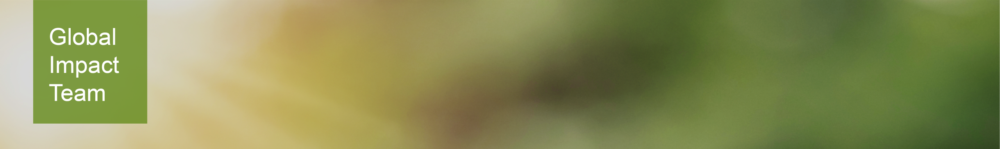

# Welcome to Sustainability Page
{: style="height:100px"}

Global Impact team is driven by our purpose to nourish the world in a safe, responsible and sustainable way, and motivated by our ambition to build the most sustainable food supply chains in the world. 

We do this through our actions to realize our environmental and social sustainability goals, track and report our progress, form key strategic alliances and engage stakeholders, invest in and enrich our communities, as well as build our reputation as a company our customers want to work with, our employees are proud to work for and our key stakeholders admire and respect.
For latest news please visit our Sharepoint Page: [Global Impact](https://cargillonline.sharepoint.com/sites/Global_Impact).

## Commands

* `mkdocs new [dir-name]` - Create a new project.
* `mkdocs serve` - Start the live-reloading docs server.
* `mkdocs build` - Build the documentation site.
* `mkdocs -h` - Print help message and exit.

## Project layout

    mkdocs.yml    # The configuration file.
    docs/
        index.md  # The documentation homepage.
        ...       # Other markdown pages, images and other files.
