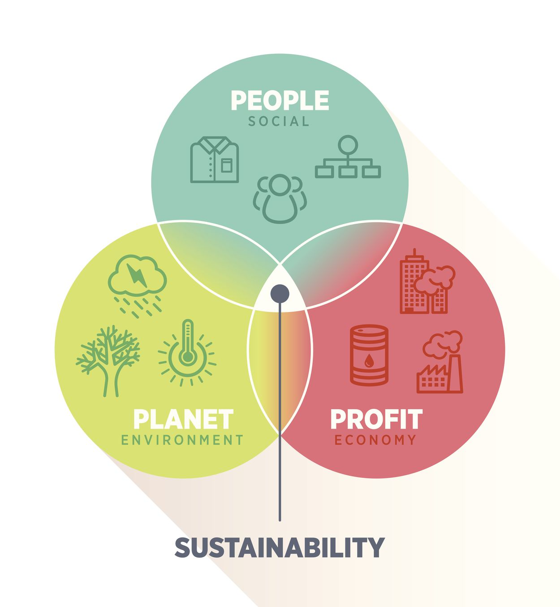

# What is sustainability

Sustainability is a way of using resources that could continue forever. A sustain-able activity is able to be sustained without running out of resources or causing harm.

If something is unsustainable, it means it’s using up resources faster than they’re being replaced. Eventually the resources will run out and the activity won’t be able to carry on.

The idea of sustainability is used in a few different ways. You’ll sometimes hear about something being financially sustainable or socially sustainable. But this article will focus on environmental sustainability

{: style="height:450px"}